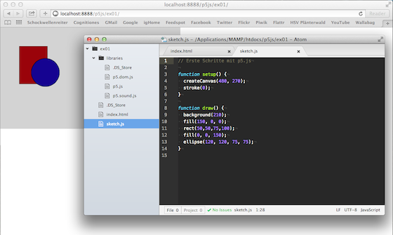

# Erste Schritte mit p5.js

Natürlich kann man Programme für p5.js auch mit der Processing-ähnlichen Mini-IDE erstellen (noch beta), aber um so richtig alle Möglichkeiten der DOM-Manipulation auszunutzen, ist es sinnvoller, mit einer HTML5-Datei, den notwendigen JavaScript- und eventuell noch ein paar CSS-Dateien zu arbeiten. Lädt man sich p5.js herunter, wird auch ein Ordner `empty-example` mit heruntergeladen, der als Ausgangspunkt für eigene Expermente dienen kann. Dieser Ordner enthält:

  * eine Datei `index.html`,
  * eine Datei `sketch.js`, die das eigentliche p5.js-Skript aufnimmt
  * und einen Ordner `libaries`, der die wichtigsten JavaScript-Dateien enthält, die es in der Datei `index.html` einzubinden gilt.

Für den Anfang reicht tatsächlich erst einmal die Datei `p5.js` aus, die anderen werden erst bei fortgeschrittenen Aufgaben benötigt.

Ich habe mich entschieden, für die Arbeit mit p5.js Githubs freien Editor [Atom][1] zu nutzen. Er schien mir dafür sehr geeignet und da ich schon lange mal mit ihm etwas anstellen wollte, um ihn näher kennenzulernen, schlage ich so zwei Fliegen mit einer Klappe.

Sinnvoll ist auch ein (lokaler) Webserver, hinter dem die Anwendung laufen soll, damit man sie mit `http://` und nicht mit `file:///` aufrufen kann. Hier kommt der bewährte [MAMP][2] zum Einsatz, der bei mir sowieso immer im Hintergrund läuft.

Jetzt freue ich mich darauf, p5.js zu entdecken. Der Vorteil gegenüber dem »normalen« Processing ist ja auch, daß die Software nicht vom Betriebssystem, sondern nur von der verwendeten JavaScript-Engine abhängig ist. So sollten die Skripte ohne Änderung auch auf meinem betagten Desktop-Computern mit MacOS X 10.6.8 *(Snow Leopard)* laufen. Dort laufen nämlich aktuelle Processing-Versionen schon lange nicht mehr. *Still digging!*

[1]: http://cognitiones.kantel-chaos-team.de/produktivitaet/atom.html
[2]: http://cognitiones.kantel-chaos-team.de/webworking/mamp.html