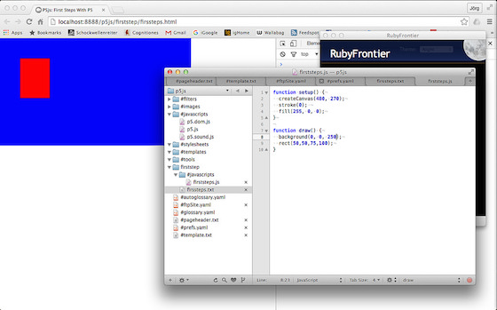
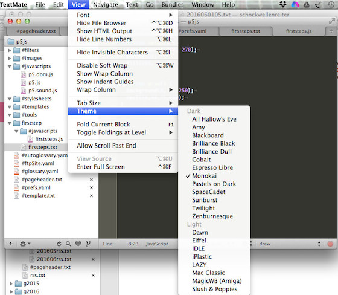

# Anhang 2: RubyFrontier als P5.js-IDE

In seinen Video-Tutorials zu P5.js traut *Daniel Shiffman* auch weniger der noch als *beta* deklarierten, mitgelieferten IDE, sondern nutzt einen Editor (in seinem Fall [Atom][2]), einen Webbrowser (Chrome) und einen Apache, um seine Skripte zu schreiben, zu testen und zu präsentieren. So kam mir die Idee, mir selber auch solch eine Umgebung mit [TextMate 2][4] und [RubyFrontier][5] zu basteln. Sie sollte in etwa so aussehen:

Als erstes habe ich also in RubyFrontier eine neue Site angelegt, aber diese dann dramatisch abgespeckt. Denn vieles, was RubyFrontier für eine »normale« Website benötigt, wird hier gar nicht gebraucht. Übriggeblieben ist erst einmal die Datei `#ftpSite.yaml`, die folgenden Inhalt aufweist:

~~~yaml
--- 
:folder: /Applications/MAMP/htdocs/p5js
:method: file
:isLocal: true
:apacheSite: /Applications/MAMP/htdocs/p5js
:apacheURL: http://localhost:8888/p5js/
~~~

Man sieht dort schon, ich benutze für die IDE [MAMP][6] als lokalen Webserver. Da ich ihn für vieles andere ebenfalls brauche, startet er sowieso beim Hochfahren meines Rechners automatisch.

Die eigentliche Template-Datei `#template.txt` ist von ergreifender Schlichtheit,

~~~
<%%= pageheader() %>
	

<%%= pagefooter() %>
~~~

denn hier soll RubyFrontier ja nur den Canvas von P5.js herausschreiben. Sollte ich später tatsächlich auch Copyright-Hinweise oder ähnliches benötigen, kann man das ja nachträglich noch einfügen.

Auch die Datei `#pageheader.txt`, die den HTML-Head in das Template einfügt, weist keine Besonderheiten auf:

~~~html
<html>
<head>
  <meta charset="UTF-8">
  <%%= metatags() %>
  <meta name="viewport" content="width=device-width">
	<!-- ><%%= linkstylesheets() %> -->
	<%%= linkjavascripts() %>
	<title><%%= sitetitle %>: <%%= title %></title>
  <!-- this line removes any default padding and style. you might only need one of these values set. -->
  
</head>

<%%= bodytag() %>
~~~

Die Direktive `<%%= linkstylesheets() %>` habe ich vorerst auskommentiert, momentan werden noch keine Stylesheets (CSS) benötigt. Wichtig ist jedoch die Direktive `<%%= linkjavascripts() %>`, denn die erfährt in den `#prefs.yaml`, welche JavaScript-Dateien sie (mindestens) laden soll:

~~~yaml
--- 
:sitetitle: "P5js"
:linkjavascripts: ["p5", "p5.dom", "p5.sound"]
:permalink: true
~~~

Da es eine (lokale) Entwicklungsumgebung ist, lasse ich alle P5-JavaScript-Bibliotheken vollständig laden und verzichte auch auf die minifizierten Versionen.

Das war alles, was an Vorarbeit erforderlich war, die restlichen Ordner und Dateien sind leergeräumt und nur für zukünftige (mögliche) Erweiterungen noch vorhanden.

Nun muß man für jedes Projekt einen Unterordner anlegen. Wegen des Mechanismusses, mit dem RubyFrontier die JavaScript-Dateien lädt, ist zwingend unterhalb dieses Ordners ein weiterer `#javascripts`-Ordner erforderlich, der die P5.js-Skripte enthält. Außerdem reagiert RubyFrontier verschnupft auf doppelte Dateinamen innerhalb einer Site, daher sollten die JavaScript-Dateien nicht alles `sketch.js` heißen, sondern individuelle Namen bekommen. Gleiches gilt für die HTML-Datei, die eben nicht jedesmal `index.txt` heißen darf, sondern auch sie sollte jeweils einen eigenen, einmaligen Namen erhalten. Meine Faustregel ist, Ordner, JavaScript- und HTML-Datei gleich zu benennen, also in dem Beispiel `firststeps` für den Projektordner, `firststeps.txt` für die HTML-Datei und `firststeps.js` für die P5-JavaScript-Datei. Aber das ist natürlich jedem selber überlassen, zumal je nach Projektgröße noch weitere Dateien und Ordner hinzukommen können.

Solch eine HTML-Datei sieht in dieser Site eigentlich immer gleich aus:

~~~html
#title "First Steps With P5"
#linkjavascripts ["firststeps"]

~~~

Sie benötigt eigentlich zwingend nur den Titel, theoretisch könnte man die `linkjavascripts`-Direktive auch wieder in eine lokale `#prefs.yaml` verfrachten, aber das hielt ich für Overkill (kann aber bei größeren Projekten mit weiteren Direktiven durchaus sinnvoll sein).

So, und nun der Vollständigkeit halber noch das minimale JavaScriptchen meines Beispiels, damit Ihr alles nachvollziehen könnt:

~~~javascript
function setup() {
  createCanvas(480, 270);
  stroke(0); 
  fill(255, 0, 0);
}

function draw() {
  background(0, 0, 250);
  rect(50,50,75,100);
}
~~~

Wegen der besseren JavaScript-Konsole habe ich -- wenn auch schweren Herzens -- Chrome zum Standard-Browser erklärt. Wenn ich nun die Seite `firststeps.txt` in den Fokus hole und sie mit `cmd-'` herausschreiben lasse, ruft RubyFrontier automatisch den Standard-Browser (also Chrome) auf, der sich vom MAMP die Datei servieren läßt. Mit einem Tastatur-Befehl wird also der ganze Prozess des Herausschreibens und des Aufrufens im Browser erledigt. Das ist doch schon ganz schön komfortabel, oder … ?

## Exkurs: TextMate 2 und Monokai

Webentwickler nutzen ja häufig das Farbschema [Monokai][7], mit dem ich ja auch [schon einmal experimentiert hatte][8]. Es ist ja auch eigentlich ganz nett, nur wenn man draußen sitzt und die Sonne auf den Monitor scheint, dann ist es kaum noch zu lesen, dann funktioniert schwarz auf weiß doch besser.

TextMate 2 ist dafür gut aufgestellt. Im Menü `View -> Theme` kann man *on the fly* unter den installierten Themes sich eines aussuchen und so nach Bedarf zwischen *Monokai* und *Mac Classic* (das sind meine beiden Favoriten) hin- und herschalten.

## Ausblick

Wie ich [hier][9] schon beschrieben hatte, lassen sich P5.js-Skripte in eine HTML-Seite mit weiteren Inhalten einbinden ([auch mit RubyFrontier][10]). Damit sind viele interessante, interaktive Dinge möglich, denn P5.js ist schlichtes JavaScript und hat somit Zugriff auf das komplette DOM der HTML-Seite. Was man damit noch alles anstellen kann, liegt momentan noch außerhalb meiner Vorstellungskraft. Aber ich arbeite daran.

[2]: http://cognitiones.kantel-chaos-team.de/produktivitaet/atom.html
[4]: http://cognitiones.kantel-chaos-team.de/produktivitaet/textmate.html
[5]: http://cognitiones.kantel-chaos-team.de/webworking/staticsites/rubyfrontier.html
[6]: http://cognitiones.kantel-chaos-team.de/webworking/mamp.html
[7]: https://www.google.de/?gws_rd=ssl#q=Monokai
[8]: http://blog.schockwellenreiter.de/essays/textwranglermonokai.html
[9]: http://blog.schockwellenreiter.de/2015/11/2015112707.html
[10]: p5rubyfrontier.md
