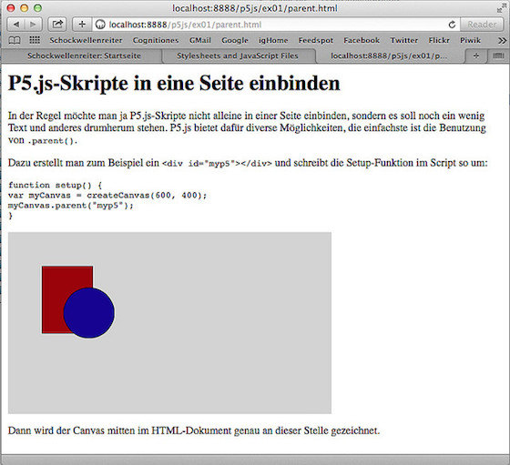

## Worknote: P5.js-Skripte in eine HTML-Seite einbinden

Wenn man P5.js-Skripte nicht in der IDE, sondern im Editor erstellt, liegt der besondere Reiz ja gerade darin, daß man nicht nur das Skript alleine im Browser laufen lassen kann, sondern das auch noch innerhalb einer stinknormalen HTML-Seite mit Texten und Bildern und Links und alles, was HTML, CSS und JavaScript sonst noch so bieten. Bindet man das Skript nun einfach in die Seite ein, wird man feststellen, daß der Canvas am Ende der Seite erscheint und das Skript dort ausgeführt wird.

Will man es nun irgendwo in der Mitte der Seite einbinden, biete p5.js diverse Möglichkeiten, wobei die Benutzung von `.parent()` die einfachste und in der Regel auch flexibelste Lösung ist.

Hierfür schreibt man einfach an die Stelle, wo der p5.js-Canvas eingebunden werden soll ein leeres `
` mit einer ID Eurer Wahl, also zum Beispiel

~~~{html}	

~~~

Diese ID nutzt Ihr nun, um den p5.js in der `setup()`-Funktion mitzuteilen, wo der Canvas hin soll:

~~~{javascript}
function setup() {
  var myCanvas = createCanvas(480, 270);
  myCanvas.parent("myp5");
  stroke(0);
}

function draw() {
  background(210);
  fill(150, 0, 0);
  rect(50,50,75,100);
  fill(0, 0, 150);
  ellipse(120, 120, 75, 75);
}
~~~

Im Gegensatz zur ersten Version des Skriptchens hat sich nur wenig verändert. Die wichtigste Unterschied ist, daß Ihr dem Canvas nun eine Variable zugeteilt habt und Ihr dieser Variable mit `.parent()` darauf hinweist, im welchen Teil des DOMs der Canvas nun hin soll.

So wie beispielsweise im obigen Screenshot kann dann Eure HTML-Seite mit dem p5.js-Skript aussehen.

Und als nächstes möchte ich herausbekommen, wie man p5.js mit [RubyFrontier][1] verheiratet. Denn dann geht der Spaß erst richtig los.

[1]: http://cognitiones.kantel-chaos-team.de/webworking/staticsites/rubyfrontier.html

