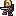
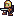

# Spieleprogrammierung mit P5.js (1)

Im Mai 2016 startete -- wie auch hier im <del>Blog</del> Kritzelheft [angekündigt][1] -- auf *Kadenze* der kostenlose P5.js-Online-Kurs »[The Nature of Code][3]« mit [Daniel Shiffman][4] gestartet. Ich habe mir die ersten Videos angeschaut und war mal wieder begeistert, wie sehr die Fröhlichkeit Shiffmans in seinen Video-Vorträgen ansteckt. Sofort fühlte ich mich motiviert, auch wieder etwas mit P5.js zu erschaffen. Und da ich mit den [Running Orcs][5] schon einmal angefangen hatte, lag es nahe, mich wieder ein wenig an der [Spieleprogrammierung][6] zu versuchen, aber dieses Mal sollte schon ein wenig Interaktivität dabei sein. Unten seht Ihr ein kleines, ein wenig zappelndes Männchen, den [Rogue][7], den Ihr mit den Pfeiltasten nach rechts und links, oben und unten bewegen könnt.

[Wie schon hier][8] habe ich das 16x16 Pixel große Kerlchen dem freien ([CC-BY-SA 3.0][9]) Tileset [DawnLike][10] entnommen -- es sind zwei Bilder, die das leichte Zappeln bewirken. Falls Ihr das Beispiel nachprogrammieren wollt, hier sind sie:

 

Und da außer dem Hin- und Herschieben der Figur ja noch nicht viel passiert, ist das Skript selber auch von erfrischender Kürze:

~~~javascript

var rogue0, rogue1;
var posx, posy;

function preload() {
    rogue0 = loadImage("../images/rogue0.png");
    rogue1 = loadImage("../images/rogue1.png");
    frameRate(30);
}

function setup() {
    var myCanvas = createCanvas(320, 240);
	myCanvas.parent("rogue01");
    posx = 160
    posy = 112
}

function draw() {
    background("green");
    if ((frameCount % 30) < 15) {
        image(rogue0, posx, posy);
    }
    else {
        image(rogue1, posx, posy);
    }
    if (keyIsPressed) {
        if ((keyCode == LEFT_ARROW) && (posx > 0)) {
            posx = posx - 16;
        } else if ((keyCode == RIGHT_ARROW) && (posx < width-16)) {
            posx = posx + 16;
        } else if ((keyCode == UP_ARROW) && (posy > 0)) {
            posy = posy - 16;
        } else if ((keyCode == DOWN_ARROW) && (posy < height-16)) {
            posy = posy + 16;
        }
    }
}

~~~

Zuerst habe ich in der `preload()`-Funktion die beiden Bilder geladen und dann in der `setup()`-Funktion das 320x240-Pixel große Spielfeld kreiert und den Helden des Spieles ungefähr in die Mitte platziert.

Damit der Canvas in die HTML-Seite eingebunden wird, wird ihm mit

	myCanvas.parent("rogue01");

die `id` eines `div` zugewiesen. Dieser `parent` muß natürlich in der HTML-Seite lokalisiert werden. Dort, wo der `Canvas` eingebunden werden soll, steht daher

	

Der Held ist -- wie schon erwähnt -- 16x16 Pixel groß und er soll an den Rändern des Spielfeldes stehen bleiben, das heißt, er soll das Spielfeld nicht verlassen können. Daher muß er zum Start so platziert werden, daß seine Koordinaten durch 16 teilbar sind, sonst bleibt er entweder zu früh stehen oder Teile seines »Körpers« ragen über das Spielfeld hinaus.

Damit der Rogue nicht zu hektisch zappelt, habe ich einen kleinen Trick angewandt: Die `frameRate` ist 30, das heißt 30 mal in der Sekunde wird das Bild neu gezeichnet. Mit

	if ((frameCount % 30) < 15)

tausche ich die Bilder aber nur nach jeder halben Sekunde aus, der Rogue zappelt also nur zwei Mal pro Sekunde.

Im letzten Teil des Codes wird einfach nur abgefragt, ob eine der Pfeiltasten gedrückt wird und ob sich der Held an einem der Spielfeldränder aufhält. Ist er tatsächlich dort, passiert nichts, sonst werden die jeweiligen x- oder y-Koordinaten um 16 Pixel erhöht oder vermindert.

Probiert es aus -- das Schöne an P5.js ist ja, daß es JavaScript pur ist und die Skripte daher in jede Webseite eingebunden werden können. Der Held bewegt sich tatsächlich.

## Caveat

Je nach Internetverbindung kann es eine Weile dauern, bis die JavaScript-Dateien und die Bilder geladen sind, daher erscheint der Canvas unter Umständen erst nach einer gewissen Zeit auf der Seite. Und es kann sein, daß er nicht den Fokus besitzt. Sollte sich also nichts bewegen, obwohl Ihr die Pfeiltasten drückt, klickt einfach mit der Maus einmal in den Canvas, dann sollte alles funktionieren.

Und das Skript funktioniert nicht im Firefox. Dieser Browser fängt das Bewegen der Pfeiltasten komplett ab, um stattdessen das Browserfenster hin- und herzuschieben. Das bewegt sich in den anderen Browsern zwar auch, aber das Männchen wird dennoch ebenfalls bewegt, diese Browser scheinen das Betätigen der Pfeiltasten an das JavaScript durchzureichen.

Ich möchte in den nächsten Tagen dieses Progrämmchen noch ein wenig ausbauen und werde dann berichten.

[1]: http://blog.schockwellenreiter.de/2016/04/2016042901.html
[3]: https://www.kadenze.com/courses/the-nature-of-code/info
[4]: http://shiffman.net/
[5]: runningorc.md
[6]: http://cognitiones.kantel-chaos-team.de/multimedia/spieleprogrammierung/spieleprogrammierung.html
[7]: http://cognitiones.kantel-chaos-team.de/medien/retrogames/rogue.html
[8]: http://blog.schockwellenreiter.de/2016/01/2016011904.html
[9]: http://creativecommons.org/licenses/by-sa/3.0/
[10]: http://opengameart.org/content/dawnlike-16x16-universal-rogue-like-tileset-v181
